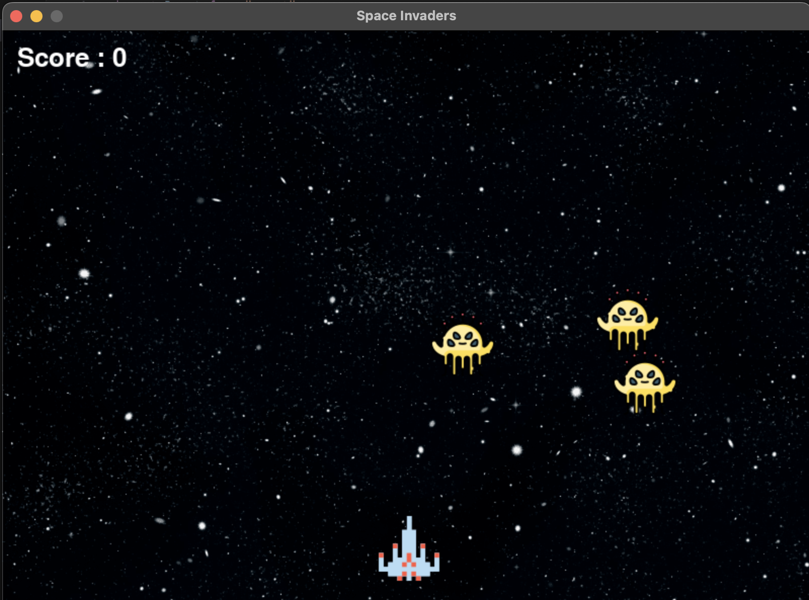

# Space Invaders :alien:

A classic arcade-style game reimagined with Python's pygame library.



## Requirements

- **Python:** Version 3.x
- **Library:** pygame

## Installation & Running

1. **Clone the Repository**

    ```bash
    git clone https://github.com/ameyakhot/Space-Invaders-2D-Game
    cd Space-Invaders-2D-Game
    ```

2. **Install pygame**

    If you haven't installed `pygame` yet, do so with:

    ```bash
    pip install pygame
    ```

3. **Run the Game**

    ```bash
    python main.py
    ```

## Gameplay

- **Move:** Use the `LEFT` and `RIGHT` arrow keys.
- **Shoot:** Use the `SPACE` key.
- **Objective:** Eliminate the alien invaders! Be careful; the game ends if they get too close.

## Features

- **Enemies:** Multiple alien enemies that move in patterns.
- **Scoring:** Keep track of your score as you eliminate the invaders.
- **Endgame:** A game over condition keeps players on their toes.

## Future Improvements

- [ ] Add multiple levels with increasing difficulty.
- [ ] Introduce power-ups for the player.
- [ ] Add background music and sound effects.

## Credits

Game inspired by the classic Space Invaders arcade game.
